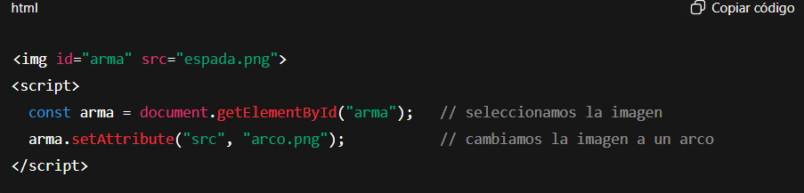
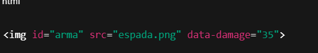

### ¿Cómo obtener o modificar atributos de un elemento HTML?

Java Script nos da la ventaja de actualizar/cambiar atributos con la página ya abierta sin necesidad de refrescarla para que se vean reflejados , pero.... cómo se hace ?

Aquí unos comandos para cambiar el nombre : 

getAttribute("nombre") → obtener el valor de un atributo.

setAttribute("nombre", "nuevoValor") → cambiar el valor de un atributo.

Acá se nos muestra 
Como si estuvieramos trabajando en un juego  y tenemos una espada , con los siguientes cambios en las pagina cambiamos de  arco a espada sin necesidad de refrescar la pagina .

Ejemplos de comados para cambiar los atributos :
el.getAttribute('nombre') → lee atributo (devuelve string o null).

el.setAttribute('nombre', 'valor') → asigna/crea atributo.

el.removeAttribute('nombre') → elimina atributo.

el.hasAttribute('nombre') → true/false si existe.

el.dataset → acceso cómodo a data- attributes (data-damage → el.dataset.damage).

el.classList → manejar clases (recomendado en lugar de cambiar class con setAttribute).

¿Qué significa "obtener un atributo"?

Es leer un dato que ya está en el HTML, sin cambiarlo.

Ejemplo: si tienes un arma con un atributo data-damage="35" (daño del arma), “obtener el atributo” significa saber cuánto daño tiene sin tocar nada.

Cómo funciona:

getAttribute → sirve para saber el daño actual del arma (como mirar estadísticas en un videojuego).

setAttribute → sirve para cambiar el arma o su daño (como equipar un nuevo arma).

Todo sucede sin recargar la página, igual que cambiar de arma o habilidad en un juego usando un combo de botones.